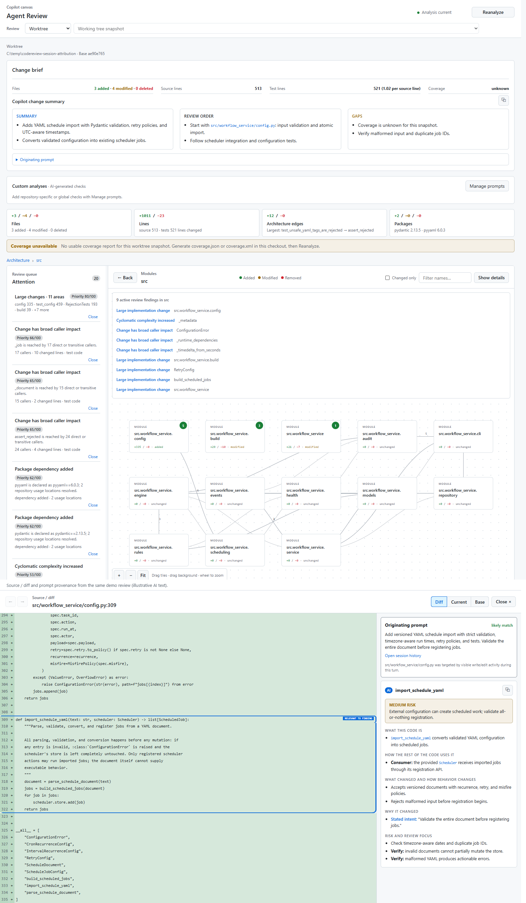

# Agent Review

A GitHub Copilot Canvas extension for reviewing agent-made changes in Python
repositories. Start with the change's intent and architecture, then follow its
impact down to findings, dependency evidence, and source diffs.

[](docs/agent-review.png)

*Two views of the same demo review: architecture and attention above; source,
prompt provenance, and briefing below. AI text and prompt provenance are
illustrative; changes, graph, and findings come from the analyzer. Click to enlarge.*

## Features and insights

### Understand the change

A change brief shows file mix, source/test churn, coverage availability, and the
originating request. Copilot uses bounded, saved implementation and test excerpts
to explain behavior changes, suggest a review order, and distinguish demonstrated
cases from evidence gaps. Clickable metrics include all reviewable files, not just Python.

### Follow architecture and impact

Drill from components to modules, classes, functions, and relationships. Added,
modified, and removed items have distinct styling; graph edges expose callers
and dependencies. A ranked attention queue highlights rule-based concerns,
with evidence, exact source locations, and persistent **Close / Reopen** controls.

### Follow code paths

The **Code paths** metric maps how each changed production function behaves:
its returns, raises, skipped iterations, error handlers, and name-based wiring
(for example, a checker loaded from a class-name string), each with its
governing condition. **Only if** marks gates that apply only when a value is
present, thresholds are called out, and added exits show which existing exit
runs before and after them, revealing fallbacks an earlier return can preempt.
Compared with the base, code paths are added, removed, changed (such as a
threshold moving from 0.9 to 0.95), or moved. Select any path to open its
line; the source pane lists the paths for the selected function, class, or
file below the Copilot briefing. Copilot summaries and briefings receive the
same deterministic map.

### See which paths are tested

Every changed path carries its test evidence, and filters show **Untested**,
**Inferred**, or **Confirmed** paths. Static analysis links tests that call
the function (or reach it through a caller) and matches their assertions to
outcomes, such as `pytest.raises(ValueError)` for a new raise, flagging checks
that match several paths. These links are labeled **inferred**. **Run linked
tests** runs only those pytest tests with line tracing restricted to the
changed files and marks each path **Confirmed** (executed by a named test) or
**Not executed**. Worktree reviews run in place; commit and PR reviews run in a
temporary export of that exact snapshot (made from Git objects through a
throwaway index, so the repository's index, refs, and files are untouched) and
delete it afterward. It runs only when you click it, shows its exact command,
uses the project's interpreter (`test_python` in `.agent-review.json`,
`AGENT_REVIEW_TEST_PYTHON`, or `.venv`), writes no pytest cache or bytecode,
and a worktree run goes stale when the worktree changes. If the tests import an
installed copy of the package instead of the reviewed files, the run says so
rather than reporting paths as not executed. Paths whose
exit shares a line with its condition cannot be confirmed by line tracing and
say so. Existing coverage reports add whether each line ran in the suite.

### Inspect the actual code

Open **Diff**, **Current**, or **Base** for the selected snapshot. Current and
Base mark added, changed, and removed lines and show where the other side's
lines were inserted or removed; a change ruler beside the scrollbar marks every
change and cited line and jumps to it on click. In Diff, each unchanged region
between changes can be expanded in place and collapsed again. Findings
highlight relevant lines; references outside diff hunks show verified,
explicitly labeled unchanged context. New diffs start at the top while keeping
referenced lines highlighted. Compact gutters, clickable source links,
and back/forward navigation keep the code central. Copilot briefings explain
usage, behavior changes, motivation, risk, and what to verify.

### Recover the agent's intent

When matching Copilot session history is available, source views show the
authoring request, follow-up activity, and a linked transcript. Provenance is
repository- and snapshot-scoped: later work cannot explain an earlier commit.
Commit reviews show the full commit message, and PR reviews show the PR
description and commit messages; Copilot compares their claims with the code.
The review heading uses the commit subject or PR title, followed by a two-line
preview of its opening body paragraph; the full message is expandable.
The originating prompt appears directly below the message with the same
two-line preview and expandable full text, preserving its session-history link.
Missing history is explicit; intent supplements rather than replaces code evidence.

### Check repository rules

A built-in **Repository rules** section in the change brief finds the
instruction files that apply to
the changed paths in the reviewed snapshot (`AGENTS.md`, `CLAUDE.md`, or
`GEMINI.md` for their directory, `.github/copilot-instructions.md`, and
`.github/instructions/*.instructions.md` by `applyTo`). Copilot then reports
rules the change appears to violate and which rules are satisfied or not
verifiable, citing rule and code lines. Select a rule file to open it with every
cited section highlighted. Rule files are treated as evidence,
never as instructions to the reviewer.

### Review dependency decisions

Added, changed, and removed Python dependencies link to manifest declarations
and consuming code. On-demand assessments explain adoption and expose PyPI
metadata, OSV advisories, OpenSSF Scorecard, maintenance, and downloads.
Vulnerability checks use the **exact project version**, never the latest release.
Unresolved ranges still permit metadata and usage explanations, but
version-specific vulnerability status remains unknown. Service failures are visible.

### Add your own checks

**Manage prompts** creates repository-specific or global AI checks. Enabled,
approved checks run after analysis against bounded, saved source/diff evidence;
results stay separate from rule-based findings. Repository prompt revisions
require approval. Checks use isolated, tool-free Copilot sessions and cannot edit code.

## Install and open

Requires a Git repository, Python **3.11+**, Node.js **20+** on PATH, and a
**GitHub Copilot app with Canvas extension support**. PR reviews support
**github.com only** and require the `gh` CLI and `gh auth login`; private
repositories also need HTTPS Git credentials (for example, `gh auth setup-git`).
No separate model API key or Python packages are needed for the analyzer.

Copy the [extension directory](.github/extensions/agent-review/) to either:

- **Personal:** `~/.copilot/extensions/agent-review`
- **Project:** `.github/extensions/agent-review` in the repository being reviewed

Start a session after installation, or reload extensions in your existing
session, then ask Copilot:

> Open the Agent Review canvas for this session's existing repository.

When updating, reload extensions and reopen only the Canvas in the same session.
**Do not delete the session or worktree.** Reanalyze updates a snapshot; it does
not reload extension code.

## Choose a snapshot

Use **Change repository** beside the repository path to review a different
existing local checkout directly. This does not create a worktree or change
the Copilot session's workspace. The chosen repository is retained when the
Canvas recovers after an extension reload. This is useful when the session's
clean worktree omits uncommitted changes in the original checkout.

| Review | Compared with |
|---|---|
| **Worktree** | Staged, unstaged, and non-ignored untracked files against the configured baseline (default: default-branch merge base) |
| **Commit** | Selected commit's first parent; an empty tree for a root commit |
| **Pull request** | Resolved PR head against its merge base with the PR base |

Switching to Commit or Pull request loads a list, not a review. Explicitly
selecting an item loads or analyzes it automatically; Worktree loads immediately.
PR objects are fetched without checking out files or changing your worktree.

Worktree selection honors Git ignore rules, including nested/global/local rules
and negations. Tracked files remain eligible even when ignored; standard generated
directories are excluded. Later edits show **Worktree changed — Reanalyze**,
without automatically restarting analysis. **Cancel** stops active analysis.
Returning to a target reuses its results while the provider remains running.

## Limits and data

- Structural analysis and rule-based checks focus on Python. Other text files
  remain reviewable as diffs. No findings is **not** a correctness guarantee;
  **Priority** ranks attention, not security.
- Code path maps are static and cover changed, non-test Python functions after
  analysis finishes, so they never lengthen the scan. They show conditions, not
  runtime reachability; very large reviews are bounded and labeled as partial.
- Worktree coverage accepts matching `coverage.json`, `coverage.xml`, or legacy
  JSON `.coverage` reports; a SQLite `.coverage` database alone is unsupported.
  Historical commit/PR reviews do not reuse live-worktree coverage.
- Analysis runs locally. AI explanations use Copilot; public package services
  receive package identifiers and public repository URLs, not source or credentials.
  AI claims and package indicators require human verification.
- Repository checks are saved in `.agent-review/prompts.json`; global checks and
  approvals in `~/.copilot/agent-review/`. Canvas recovery records live in
  `~/.copilot/agent-review/canvases/` (`AGENT_REVIEW_STATE_DIR` overrides this).
- Unchanged Python scans are reused across worktree, commit, and PR reviews
  (including linked worktrees). Content, file path, repository identity, Python,
  and analyzer versions key the cache; snapshot-wide relationships, findings,
  diffs, and coverage remain fresh. Progress reports reused/scanned counts.
  Derived code facts persist in `~/.copilot/agent-review/file-cache/file-scans.sqlite3`
  (`AGENT_REVIEW_CACHE_DIR` overrides the directory). LRU limits are 128 MiB of
  payload, 8,192 entries, and 4 MiB per entry, plus SQLite overhead. Use
  `--no-cache` for a fresh standalone comparison; close Agent Review before
  deleting that database to clear stored facts.

## Development

### Language adapter boundary

Snapshot loading, review lifecycle, source navigation, and UI remain shared.
The only implemented language adapter is **Python**; Node/TypeScript and C#
backends are not yet registered or advertised.

- `analyzer/language_adapters.py` defines the snapshot contract and selects
  adapters using both trees (including deleted sources and manifest-only changes).
  Each adapter owns dependency parsing, graph facts, package usage, and coverage.
  `python_adapter.py` delegates to the existing Python implementations, resolving
  its graph in an isolated model before merging facts. Python DTOs and the
  content-cache namespace are preserved, so existing warm scans remain reusable.
- `language-adapters.mjs` routes post-scan code-path requests and test runners.
  `python-review-adapter.mjs` owns Python callable/test linkage and the parser
  process specification. Per-language results merge into the shared code-path
  view; unknown adapters and duplicate callable IDs fail explicitly.
- `web/languages.mjs` shares implemented source-language and test-path
  classification between the browser and provider. Test interpreter selection,
  command planning, and execution are dispatched through the adapter, while
  snapshot export, cancellation, staleness, and trace-to-source mapping stay shared.

New compiler adapters must use collision-free symbol/dependency identities,
resolve against their snapshot's project configuration, version their fact
caches, and return the existing evidence DTOs. Do not restore packages, build,
or execute repository code during scanning. Combined execution of different
languages' test runners is deliberately rejected until its plan/result contract
is implemented; Python runs continue unchanged. Code-path extraction and test
linkage still start only after scanning, and tests run only by explicit action.

The [analyzer](.github/extensions/agent-review/analyzer/analyze.py) also runs
standalone with `--repo <repository>` and emits `ReviewModel` JSON. Override Python
discovery with `AGENT_REVIEW_PYTHON`; Canvas inputs `repoPath` and `baseRef`
override repository/baseline discovery. UI changes follow [AGENTS.md](AGENTS.md).

```powershell
python -m unittest discover -s .github\extensions\agent-review\tests -p "test_*.py"
node --test .github\extensions\agent-review\tests\test-*.mjs
```

[Browser regressions](.github/extensions/agent-review/tests/browser/) use an
existing `playwright-core` installation (`AGENT_REVIEW_BROWSER_PACKAGE`) and Edge
on Windows, or `AGENT_REVIEW_BROWSER_EXECUTABLE` for another browser.
